# lab-002

Training a simple net with backpropagation.

Much of the code is adapted from lab-001.

## Result

In the following tests, the conditions (unless otherwise specified) are:

- A 3-layer fully connected neural network $(784-100-10)$
- One gradient descent step is performed per mini-batch.

_In fact, the results presented below can't show a clear pattern and exhibit significant uncertainty, even with identical parameters._

### test-001 Learning Rate $0.1$

In this test, the learning rate is set to $0.1$.

It takes about 2 seconds to finish an epoch.

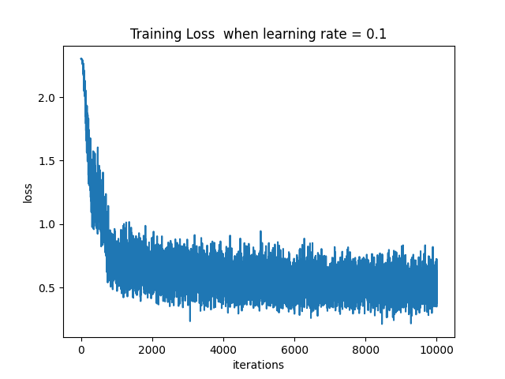
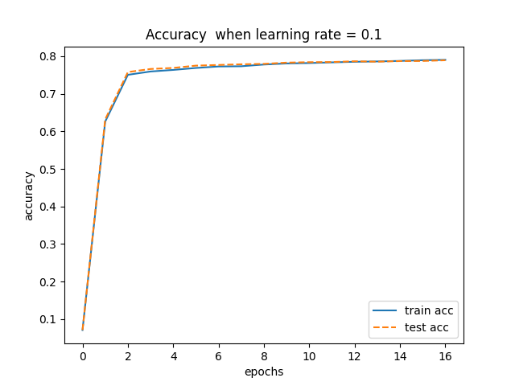

The result isn't pretty, as the accuracy only reached about $80\%$.

### test-002 Learning Rate $0.21$

In this test, the learning rate is set to $0.21$.

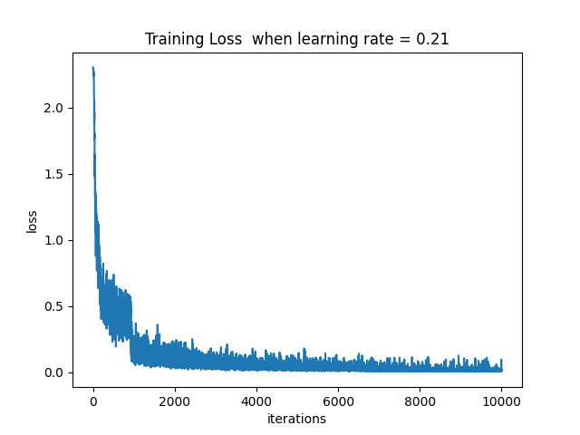
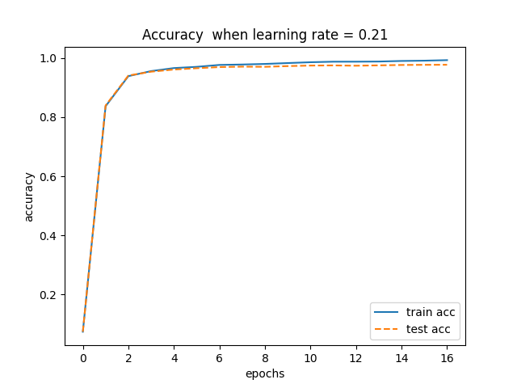
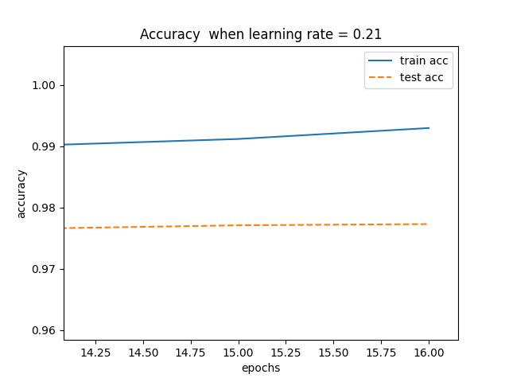

The result is better than test-001.  
Finally the accuracy reached about $97.7\%$.  
One interesting fact is that the process is quite different among certain runs.  
A strange example is provided here. (Note that it's from a different test run than the figures shown above)

```plain
Epoch 0: Train acc = 0.74 | Test acc = 0.75
Epoch 1: Train acc = 0.76 | Test acc = 0.76
Epoch 2: Train acc = 0.77 | Test acc = 0.77
...
Epoch 10: Train acc = 0.79 | Test acc = 0.78
Epoch 11: Train acc = 0.79 | Test acc = 0.78
Epoch 12: Train acc = 0.79 | Test acc = 0.78
Epoch 13: Train acc = 0.97 | Test acc = 0.96
Epoch 14: Train acc = 0.98 | Test acc = 0.97
Epoch 15: Train acc = 0.98 | Test acc = 0.97
```

In epoch $1\sim 12$ there's little progress. But in epoch 13 the accuracy increases a lot.  
I guess it's because the initialization weight lacks a proper justification, and it influence the learning process a lot.

### test-003 Learning Rate $1$

In this test, the learning rate is set to $1$.

There are two different results shown below.

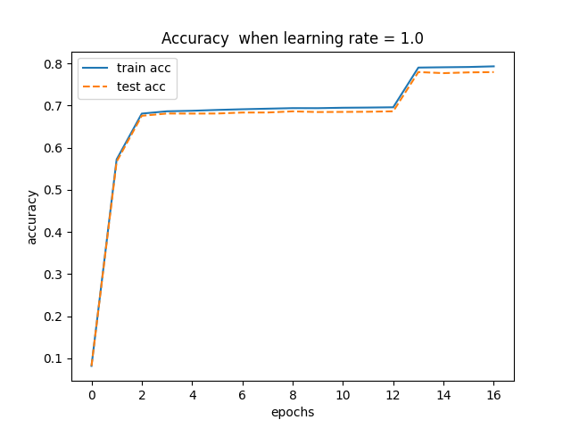
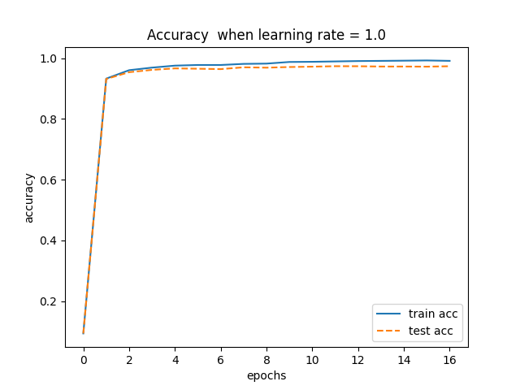

### test-004 Learning Rate random in $[0,1)$

In this test, each mini-batch has a random learning rate.

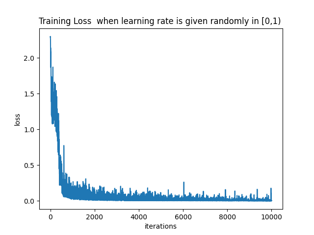
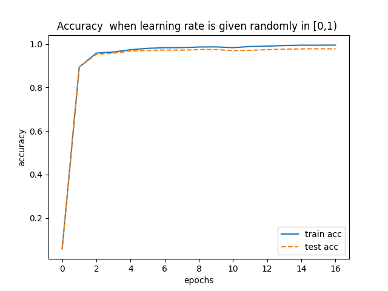
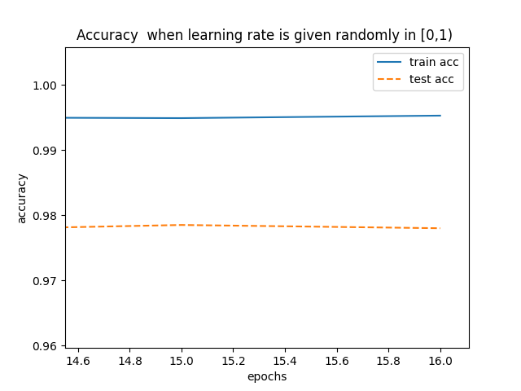

### test-005 $784-1-10$ Network

In this test, there's only one node in the hidden layer.  
learning rate is $0.21$.

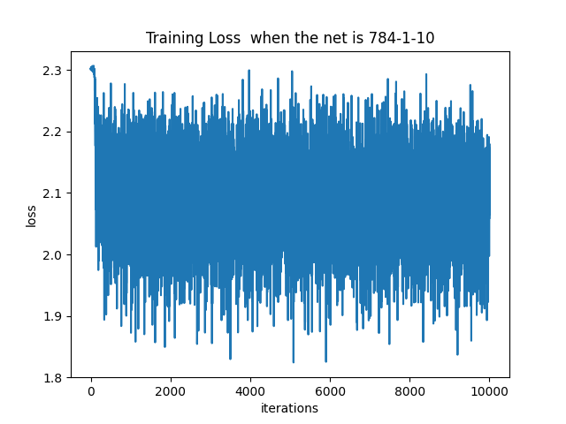
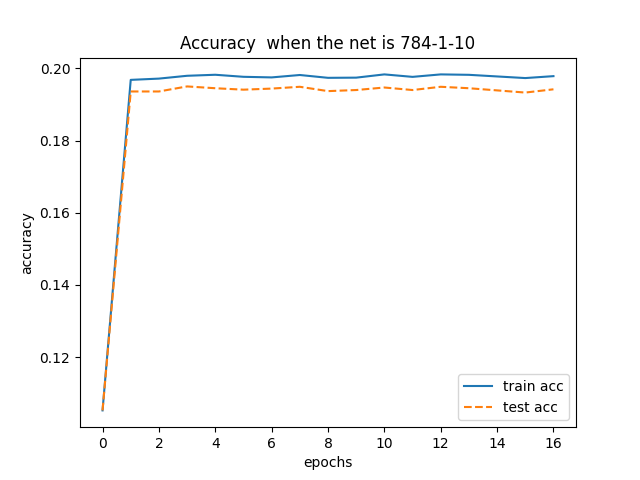

### test-006 $784-2-10$ Network

In this test, there are only two nodes in the hidden layer.  
learning rate is $0.21$.

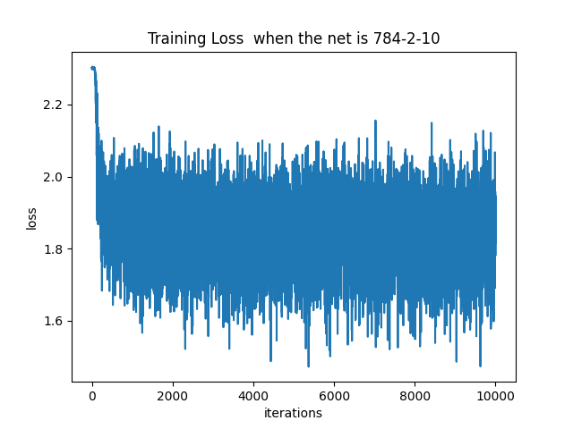
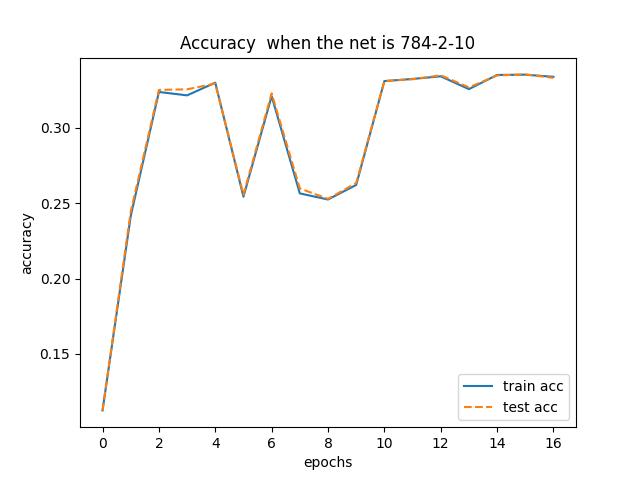

It seems that the results of test-005 and test-006 aren't as bad as I think.
